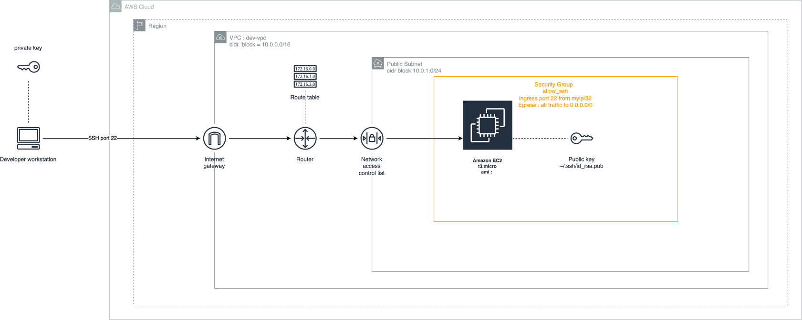

# Secure AWS Web Server Infrastructure with Terraform

This repository contains the Infrastructure as Code (IaC) configuration to deploy a secure, isolated custom Virtual Private Cloud (VPC) on AWS featuring a publicly accessible Ubuntu Linux web server. 

The infrastructure is built from scratch, ensuring that default AWS resources are left untouched for maximum compliance, security, and environment isolation.

## 🚀 Architecture Overview

The Terraform configuration provisions the following components in your chosen AWS region:
* **Custom VPC:** An isolated network environment using the `10.0.0.0/16` CIDR block.
* **Public Subnet:** A specific subnet tier designed to host internet-facing resources.
* **Internet Gateway (IGW):** Tied to the custom VPC to allow communication with the outside world (\$0 base cost).
* **Route Table:** Explicitly directs outbound traffic (`0.0.0.0/0`) from the public subnet to the Internet Gateway.
* **Security Group (`allow_ssh`):** Acts as a virtual firewall allowing inbound **SSH (Port 22)** traffic.
* **AWS Key Pair:** Dynamically registers your local machine's existing public key with AWS for secure, passwordless authentication.
* **EC2 Instance (`web_server`):** A cost-efficient `t3.micro` instance running the latest **Ubuntu LTS** operating system.

---

---

## 📋 Prerequisites

Before deploying, ensure you have the following installed and configured on your local machine:

1. **Terraform CLI** (v1.0.0+)
2. **AWS CLI** configured with your IAM administrative credentials (`aws configure`)
3. An existing **SSH Key Pair** on your local machine located at `~/.ssh/id_rsa` and `~/.ssh/id_rsa.pub`

---

## 🛠️ Deployment Steps

1. **Clone the repository:**
   ```bash
   git clone https://github.com/jcmeena/secure_ssh_to_server.git
   cd secure_ssh_to_server
   ```

2. **Initialize Terraform:**
   This downloads the necessary AWS provider plugins.
   ```bash
   terraform init
   ```

3. **Review the Execution Plan:**
   Verify the resources Terraform is going to create.
   ```bash
   terraform plan
   ```

4. **Apply the Infrastructure:**
   Deploy the resources to your AWS account. Type `yes` when prompted.
   ```bash
   terraform apply
   ```

---

## 🔒 How to Connect via SSH

Because this architecture utilizes an **Ubuntu** image, the default administrative username is hardcoded by Canonical as **`ubuntu`** (not `ec2-user`). 

1. **Secure your local private key:**
   Ensure your local SSH private key has the strict permissions required by OpenSSH:
   ```bash
   chmod 400 ~/.ssh/id_rsa
   ```

2. **Establish the connection:**
   Run the following command in your terminal, replacing `<instance-public-ip>` with the public IP printed out by your AWS Console or Terraform output:
   ```bash
   ssh -i ~/.ssh/id_rsa ubuntu@<instance-public-ip>
   ```

3. **Verify the connection:**
   Upon successful login, you will be greeted by the official Ubuntu system banner detailing your server stats and internal private IP assignment.

---

## 🧼 Cleanup

To tear down the environment completely and prevent unexpected AWS charges for your dev/test environment, run:
```bash
terraform destroy
```
